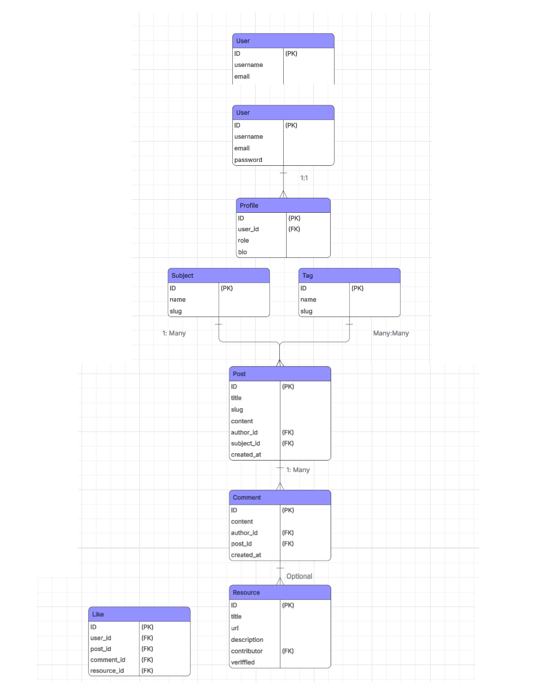

# MSP3-Guitar-Blog

## Scope & Content

### Scope

Concept:

As someone who has both taught guitar and learned independently, I have found that platforms such as YouTube provide an enormous amount of valuable content but can also be overwhelming for beginners and intermediate learners. With many different teachers, teaching philosophies, and lesson structures available, learners can often end up "going down rabbit holes" of content without developing a balanced or structured learning progression. This can lead to knowledge gaps in key areas such as technique, theory, or practice structure.

The goal of this project is to develop a community-driven guitar learning platform where teachers can publish structured learning posts in clearly defined subjects. Other users can participate by discussing the posts and sharing additional learning resources such as videos, articles, or tablature.

The site combines elements of a blog, forum, and collaborative resource hub, allowing learners to discover structured lessons while benefiting from community recommendations and discussion.

Content is organised into subjects and tags, and users can filter the feed to discover relevant content. A teacher-level role acts as a moderator layer, with the ability to verify community-submitted resources, helping highlight high-quality learning materials.

Users can also like posts, comments, and resources, allowing the most helpful contributions to surface within the community.

### Content & Wireframes

#### 1. Global Structure - global navbar

Primaary Navigation (top)

**Home / Logo**

- Returns the user to the main homepage feed.

**Subjects**

- Dropdown navigation displaying available subject areas.

- Examples include:
  - Practice
  - Songs
  - Equipment
  - Music Theory
  - Tips
  - Listening

**Search Bar**

- Allows users to search across:
  - post titles
  - post content
  - resource titles
  - resource descriptions.

**Profile**

- Access to the logged-in user's profile page.
- Displays the user's contributions and profile information.
- Provides access to profile editing and logout functionality.

#### 2. Home Page/ Main Feed Page - index.html

The homepage displays the **main community feed**, combining posts and shared learning resources.

This feed allows users to discover the latest or most relevant learning content across the platform.

### Feed Wireframe

**Filter Bar**

Users can refine the content shown in the feed using several filters.

Filter options include:

- Subject filter
- Tag filter
- Search query
- Content type (Posts or Resources)

### Feed Content Structure

Items in the feed appear in **reverse chronological order** and include both posts and resources.

Each item displays:

- Like count (community feedback)
- Title
- Author
- Subject category
- Tags
- Creation date

For posts, additional indicators include:

- Number of comments
- Number of attached resources

This feed is **paginated** to improve performance and readability when large amounts of content are present.

#### 3. Subject Landing Pagee

`subject_list.html`\
`subject_detail.html`

Subjects organise learning content into clearly defined topic areas.

### Subject List Page

Displays all available subjects along with:

- Subject name
- Brief description
- Number of posts
- Number of resources

This allows users to explore learning topics and navigate to specific subject areas.

### Subject Detail Page

The subject page displays content related to a specific learning category.

The page includes:

- Subject title and description
- Tag filters specific to the subject
- Combined feed of posts and resources related to that subject

Users can further filter the subject feed by:

- tags
- keyword search
- content type (posts or resources)

#### 4. Post Page - posts/

`post_detail.html`\
`create_post.html`\
`edit_post.html`

Posts represent the **core learning content** on the platform.

Posts are created by users with the **Teacher role** and typically contain structured lesson material or instructional content.

### Post Detail Page

The post page is designed to maximise readability and discussion.

**Post Header**

Displays:

- post title
- author
- subject
- tags
- minimum skill level required

### Content Section

The main content area displays the full post text using a rich text editor format.

This allows teachers to format lessons clearly with headings, paragraphs, and structured explanations.

---

### Resources Section

Users can attach learning resources to posts or comments.

Each resource displays:

- title
- link to the external material
- description
- contributor
- like count
- verification badge (if approved by a teacher)

Teachers can mark resources as **verified**, highlighting high-quality or recommended materials.

---

### Discussion Section

Below the post content is the discussion area where users can comment.

Features include:

- threaded discussion style comments
- like functionality for comments
- ability to attach a learning resource when posting a comment

Comments are ordered by:

1.  like count
2.  creation date

This helps surface the most helpful responses.

#### 5. User Profile Page

`profile.html`

The profile page displays a user's identity and contributions to the platform.

### User Information Card

Displays:

- username
- user role (beginner, intermediate, advanced, teacher)
- biography

---

### Contribution Feed

The profile page also shows the user's activity in the platform.

Content displayed includes:

- posts created by the user
- resources shared by the user

These are displayed in a combined feed similar to the homepage and can be filtered by subject, tags, or search.

#### 6. Registration Page

`register.html`

The registration page allows new users to create an account.

The form collects the following information:

- username
- email address
- password
- skill level (beginner, intermediate, advanced)

This information is used to create a **User account and associated Profile model**, which stores the user's role and optional biography.

After registration, users are automatically logged in and redirected to the homepage.

#### Key Platform Interactions

The platform supports several community-driven interactions:

### Likes

Users can like:

- posts
- comments
- resources

This helps highlight helpful contributions and encourages engagement.

---

### Resource Sharing

Users can share external learning resources by:

- attaching them to comments
- submitting standalone resources

Resources may include:

- YouTube tutorials
- online articles
- guitar tablature
- instructional material

Teachers can verify resources to highlight trusted content.

---

### Filtering and Discovery

Users can discover content using:

- subject categories
- tags
- keyword search
- content type filters

This allows learners to focus on relevant learning material without being overwhelmed by unrelated content.

## UX

### User Stories

#### User Story 1. Beginner Level User– Discovering beginner content

Acceptance Criteria

- User selects “Beginner” during onboarding or in profile
- Feed defaults to showing Beginner-level posts
- User can see level labels on every post
- User can override filters manually if desired

#### User Story 2. Beginner Level User– Getting help in discussions

Acceptance Criteria

- User can post a reply or question on a learning post
- Replies display author level badge
- Teacher replies are visually distinct
- Replies can be upvoted

#### User Story 3. Beginner – Using recommended resources

Acceptance Criteria

- Learning posts display a “Resources” section
- Resources include title, type, and description
- User can upvote resources
- Resources are sorted by usefulness score by default

#### User Story 4. Intermediate User – Filtering by technique

Acceptance Criteria

- Posts support multiple tags (e.g. speed, rhythm)
- User can filter by subject and tag
- Filters update results without page reload (UX)
- Filter state is clearly visible

#### User Story 5. Intermediate User– Sharing resources

Acceptance Criteria

- User can add a resource via URL
- User must select resource type
- User must provide a short justification
- Resource appears immediately in the post

#### User Story 6. Advanced Users – Weighted advice

Acceptance Criteria

- User level affects vote weight internally
- UI does NOT expose raw calculations to users
- Replies are sorted by usefulness score
- Higher-quality replies naturally surface

#### User Story 7. Advanced Users– Curating content

Acceptance Criteria

- Advanced users can upvote/downvote resources
- Vote affects resource ranking
- Resource ranking updates dynamically
- Low-rated resources are visually deemphasized

#### User Story 8. Teacher/ Moderator User – Verifying guidance

Acceptance Criteria

- Teachers have a “Verify Advice” action
- Verified replies show a badge
- Only teachers can verify content
- Verification is reversible (moderation)

#### User Story 9. Teacher/ Moderator User Level – Identifying unanswered

Acceptance Criteria

- System detects posts with unanswered questions
- Teachers have a filtered view or indicator
- Sorting by “Needs help” is available
- Clicking opens discussion directly

## User Profile

The 2 main distinct user profiles/roles for this site is Teacher vs Student, student being split into: Beginner, intermediate and advanced. Which will be part of the users' profile.

Teacher will only be asigned by admin through application to ensure learning content is moderated and to protect brand integrity.

The teacher profile would be experienced teachers and/or content creators who want to provide continued content, this will allow them to cross promote their existing social media channels.

The students will be self learning people interested in learning the instrument in a structured and thorough way, traffic mainly coming through the existing teachers existing channels and recommendations.

## User Journey

### Overview

The platform is designed as a structured, subject based guitar learning community where different levels of users interact through posts, comments and shared learning resources. The User Journey ensures intuitive navigation, clear content organisation and meaniningful engagement via the contribution system.

### First Time Visitor

Journey

1. Lands on the homepage.
2. Browses subjects from the subject list.
3. Selects a subject.
4. Views posts by subject.
5. Opens a post.
6. Reads comments and shared resources.
7. Registers to participate in community.

Value:

1. Clear subject organisation and orientation.
2. Ranked comments with upvote system and teacher verification.
3. Quick onboarding via register form.

### Registered Student (Role: Beginner - Advanced)

Journey:

1. Logs into account
2. Reads recent posts via homefeed
3. Navigates or filters to subject for posts and resources.
4. leaves comment and optionally shares resources for posts.
5. votes on helpful resources.
6. See's own profile for their contribution.

Value:

1. Ability to contribute knowledge
2. Ability to provide feedback through comments and voting.
3. Can build profile reputation through displayed activity.

### Teacher User

(Can publish learning posts)

1. log into account
2. Create a new post
3. Assign a subject to post with any relevant tags
4. Publish post
5. Engages with students comments and resources.
6. Moderates and monitors resources shared under their posts.

### Returning User

For continued learning.

Journey:

1. Logs in
2. Returns to subject or feed
3. Filters chosen subject and tags
4. Views resources.

Value:

1. Structured navigation.
2. Dynamic filtering
3. Ranked content

## Interaction Design

## Accessbility & Best Practises

## Visual Design

## Data Model Design

### Data Model Diagram

### Data Entity Relationship Table

The following table outlines the main entities used in the application, their key attributes, and how they relate to other entities within the database.

Corrected Table
| Entity | Key Fields | Relationships | Description |
| --- | --- | --- | --- |
| **User** | id, username, email, password | One-to-One with Profile | Django's built-in authentication model used to manage user accounts and login credentials. |
| **Profile** | id, user, role, bio | One-to-One with User | Extends the default Django user model to include additional information such as skill level and biography. Determines whether a user has teacher privileges. |
| **Subject** | id, name, slug, description | One-to-Many with Post One-to-Many with Resource | Represents a high-level learning category (e.g. Practice, Theory, Songs). Used to organise posts and resources. |
| **Tag** | id, name, slug | Many-to-Many with Post | Provides more granular classification of posts within subjects. Enables filtering and search. |
| **Post** | id, title, slug, content, author, subject, min_level, created_at | Many-to-One with User (author) Many-to-One with Subject Many-to-Many with Tag One-to-Many with Comment One-to-Many with Resource | Represents the main learning content published by teachers. Posts act as discussion threads where users can comment and share resources. |
| **Comment** | id, content, author, post, created_at | Many-to-One with User Many-to-One with Post One-to-Many with Resource | Represents user discussion responses to posts. Comments can also contain shared learning resources. |
| **Resource** | id, title, url, description, contributor, verified, created_at | Many-to-One with User Many-to-One with Post (optional) Many-to-One with Comment (optional) Many-to-One with Subject | Represents external learning materials such as videos, articles, or tablature. Resources may be attached to posts or comments. |
| **Like** | id, user, post, comment, resource | Many-to-One with User Optional relation to Post, Comment, or Resource | Implements the voting system allowing users to like posts, comments, or resources. A validation rule ensures only one target is selected per like. |

## Relationship Overview

The relationships between entities are designed to support **collaborative learning and content discovery**.

### User Relationships

- A **User** has **one Profile**
- A **User** can create:
  - many Posts
  - many Comments
  - many Resources
  - many Likes

---

### Content Structure

The learning content structure follows a hierarchical pattern:

Subject\
 └── Post\
 └── Comment\
 └── Resource (optional)

Resources may also be attached directly to posts.

---

### Tagging System

Posts can belong to multiple tags:

Post\
 ↔ Tag

This many-to-many relationship allows flexible filtering and topic grouping.

---

### Voting System

The Like model supports engagement across multiple content types.

User\
 └── Like\
 ├── Post\
 ├── Comment\
 └── Resource

Each like is associated with only **one target object**, enforced by model validation.

---

### Summary

The data model supports the following key platform behaviours:

- **Structured learning content** through teacher-created posts
- **Community discussion** through comments
- **Collaborative resource sharing**
- **Content discovery through subjects and tags**
- **Community feedback via likes**
- **Quality control through teacher resource verification**

## Architechture Overview

### Application Architecture

The application used the Django Model View Template structure.

- Models define the database schema and relationships.
- Forms manager user input and validation.
- Views process requests, apply logic and return response.
- URLs route incoming requests to relevant views.

The platform functions as a community based guitar learning forum, combining structured teaching posts with discussion, shared resources and votes/ likes.

## Models

Models define the database stucture and the relationship between users, content and interactions.

### Subject

A high level category of learning content. Used for organising posts and resources.

Examples:

- Practise
- Theory
- Equipment
- Songs

Each subject includes:

- Name
- Slug
- Short Description for listing
- Full Description for detail
- Associated tags

### Tag

Tags provide more granullar classification than subjects.

Examples:

- Chords
- Fingerstyle
- Improvisation

Posts may have multiple tags to enable flexible filtering.

### Profile

The Profile model extends Djangos built in User model.

Stores additional information:

- User skill level (role)
- Bio
- Reputation statistics (likes/votes given/received)

Roles:

- Beginner
- Intermediate
- Advanced
- Teacher

Teachers have aditional permissions such as creating posts and verifying resources.

### Post

The Post model represents the main learning content created by teachers.

Each post includes:

- title
- slug
- author
- subject category
- tags
- content
- minimum skill level requirement
- publication status
- creation timestamp

Posts serve as the primary discussion threads where users can comment and share resources.

### Comment

The Comment model allows users to participate in discussion under posts.

Each comment stores:

- associated post
- author
- content
- creation timestamp
- approval status

Comments support collaborative learning and may also include attached learning resources.

### Resource

Resources represent external learning materials shared by users.

- YouTube tutorials
- blog articles
- instructional PDFs

May be assigned to:

- Posts
- Comments

Each resource stores:

- title
- URL
- description
- contributor
- associated subject
- verification status
- creation timestamp

Teachers can mark resources as verified to highlight high-quality learning material.

### Like

The Like model implements a flexible voting system.

Users may like:

- posts
- comments
- resources

Each like stores:

- the user who cast the vote
- the target object
- timestamp

A validation rule ensures that only one target type can be selected per like, and a uniqueness constraint prevents duplicate likes.

## Forms

Forms handle user input and validation before saving to the database.

### Register Forms

Extends Django’s built-in UserCreationForm.

Additional fields include:

- email
- skill level/ role

### PostForm

Used for creating and editing learning posts.

Fields include:

- title
- slug
- content (edited using Summernote rich text editor)
- minimum skill level
- subject
- tags

If no subject is selected when creating a post, the form attempts to default to **"Uncategorized"**.

### CommentForm

Allows users to submit comments under posts.

The form also includes optional fields allowing users to attach a resource when posting a comment.

Optional resource fields include:

- resource title
- resource URL
- resource description

A validation method ensures URLs include a proper protocol.

---

### ResourceForm

Used for creating or editing learning resources.

Fields include:

- title
- URL
- description

URL validation ensures external links are correctly formatted.

---

### ProfileForm

Allows users to update their profile information.

Editable fields include:

- skill level
- biography

The **teacher role is intentionally excluded** from the form to prevent users from granting themselves elevated permissions.

## Views

Views contain the core application logic and coordinate interactions between models, forms, and templates.

---

### Feed Views

#### `home`

The root URL of the application.

This view simply redirects to the main feed view (`index`) to keep routing logic separate from feed logic.

---

#### `index`

The main homepage feed.

This view combines **posts and resources into a single chronological feed**.

Features implemented include:

- subject filtering

- tag filtering

- keyword search

- content type filtering (posts or resources)

- combined sorting by creation date

- pagination

- like status detection for logged-in users

- AJAX support for partial feed updates

---

### Post Views

#### `post_detail`

Displays a single post along with:

- comments

- attached resources

Comments and resources are ordered by **like count and creation date** to highlight the most useful contributions.

Users can also submit new comments and attach resources through this view.

#### `create_post`

Allows teachers to create new posts.

Access is restricted using:

- `login_required`

- role checking for `"teacher"`

The form saves the post and assigns the logged-in user as the author.

#### `edit_post`

Allows the author of a post to edit it.

Authorization ensures that only the original author can modify the post.

#### `delete_post`

Allows the author to delete their post after confirmation.

---

## Comment Views

#### `edit_comment`

Allows a user to edit a comment they previously created.

---

#### `delete_comment`

Allows a user to delete their own comment.

---

## Resource Views

#### `edit_resource`

Allows users to edit resources they have contributed.

---

#### `delete_resource`

Allows users to delete their own resources.

---

#### `verify_resource`

Allows teachers to mark a resource as **verified**.

This acts as a quality indicator for helpful learning materials.

---

### Profile Views

#### `profile_view`

Displays a user profile page including:

- profile information

- posts created by the user

- resources shared by the user

Posts and resources are combined into a chronological feed similar to the homepage.

Filtering options remain available for subject, tags, and search.

---

#### `edit_profile`

Allows a logged-in user to update their profile information.

---

### Authentication Views

#### `register_view`

Handles user registration.

When a user registers:

- a new `User` is created

- their chosen role is stored in the associated `Profile`

- the user is automatically logged in

---

#### `login_view`

Handles user authentication using Django's built-in authentication form.

---

#### `logout_view`

Logs out the current user and redirects them to the homepage.

---

## Voting Views

#### `like_post`

Allows users to like or unlike a post.

Users cannot like their own posts.

AJAX responses allow the frontend to update like counts dynamically.

---

#### `like_comment`

Allows users to like or unlike comments.

---

#### `like_resource`

Allows users to like or unlike shared resources.

---

## Subject Views

#### `subject_list_view`

Displays all subjects along with counts of:

- posts

- resources

This helps users navigate learning topics.

---

#### `subject_detail_view`

Displays content associated with a specific subject.

Users can filter results by:

- tag

- search query

- content type

Posts and resources are merged into a combined feed similar to the homepage.

---

### Utility Views

#### `get_subject_tags`

An AJAX endpoint used to dynamically retrieve tags associated with a selected subject.

This allows the interface to update filtering options without refreshing the page.

## URL Structure

# URL Structure

The URL configuration maps incoming requests to the appropriate views.

Routes are grouped by feature area.

---

### Home

| URL | Description       |
| --- | ----------------- |
| `/` | Main content feed |

---

### Posts

| URL                    | Description       |
| ---------------------- | ----------------- |
| `/create/`             | Create a new post |
| `/post/<slug>/`        | View post         |
| `/post/<slug>/edit/`   | Edit post         |
| `/post/<slug>/delete/` | Delete post       |

---

### Comments

| URL                     | Description    |
| ----------------------- | -------------- |
| `/comment/<id>/edit/`   | Edit comment   |
| `/comment/<id>/delete/` | Delete comment |

---

### Resources

| URL                      | Description     |
| ------------------------ | --------------- |
| `/resource/<id>/edit/`   | Edit resource   |
| `/resource/<id>/delete/` | Delete resource |
| `/verify-resource/<id>/` | Verify resource |

---

### Voting

| URL                    | Description          |
| ---------------------- | -------------------- |
| `/like-post/<id>/`     | Like/unlike post     |
| `/like-comment/<id>/`  | Like/unlike comment  |
| `/like-resource/<id>/` | Like/unlike resource |

---

### Profiles

| URL                    | Description  |
| ---------------------- | ------------ |
| `/profile/<username>/` | View profile |
| `/profile/edit/`       | Edit profile |

---

### Subjects

| URL                 | Description    |
| ------------------- | -------------- |
| `/subjects/`        | List subjects  |
| `/subjects/<slug>/` | Subject detail |

---

### Authentication

| URL          | Description       |
| ------------ | ----------------- |
| `/register/` | User registration |
| `/login/`    | Login             |
| `/logout/`   | Logout            |

---

### AJAX

| URL                  | Description                         |
| -------------------- | ----------------------------------- |
| `/get-subject-tags/` | Returns tags for a selected subject |

## Technologies Used

## Future Improvements
